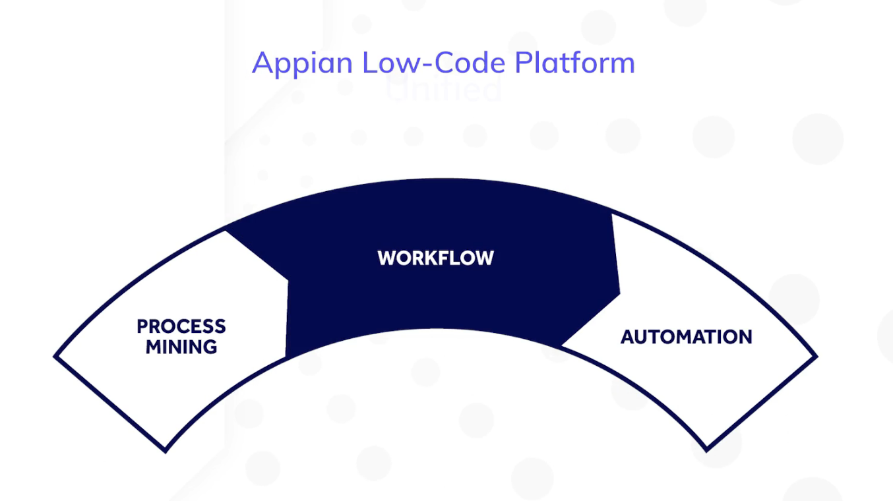

## Lesson 1: Appian Essentials

This lesson will serve as introduction to the Appian low-code platform, which includes the following key capabilities: **process mining**, **workflow**, and **automation**.

**Appian** is a unified low-code platform that you can use to discover, design, and automate your organization's processes.

As a **low-code platform**, Appian provides developers with a wealth of low-code tools for building applications such as...
* Point-and-click configurations
* Pre-built features
* Drag-and-drop components

As a **unified platform**, Appian provides developers with visibility and control that disconnected tools simply don't have. Using Appian, you can...
* Automate complex workflows.
* Converge data from disparate systems into a central location.
* Build attractive, informative, and easy-to-use UIs for your business users.

### Appian's Key Capabilities

#### Workflows

**Workflow** refers to a sequence of tasks that process a set of data. Any time data is passed between employees and systems, a workflow is created.

We can see Appian workflow capabilities in action through the **Appian Process Modeler**, a tool used to bring humans and automation together. The Appian Process Modeler is equipped with an extensive selection of drag-and-drop activities that a developer can use to assign tasks to users, then route the process flow, and execute specialized business services based on the user's input.

#### Process Mining

This technology allows you to analyze processes at your organization using event logs. Once you define the scope and focus of your analysis and gather data to support it, Appian provides you with the tools to transform your data into an event log that **Appian Process Mining** analyzes to gain insight into your important processes.

With Appian Process Mining, you can...
* Identify the causes of bottlenecks.
* Compare whether workflows in the field conform to organizational best practices.
* Assess performance against target KPIs.

Process mining can also be used to discover automation opportunities for non-Appian processes. Once you automate these processes in Appian, you will be able to continuously benefit from the conformance and process enhancement capabilities of Appian Process Mining.

#### Automation

Appian provides you with a suite of automation capabilities, or "digital workers." These capabilities include...
* Robotic Process Automation (RPA)
* Artificial Intelligence (AI)
* Intelligent Document Processing (IDP)
* Business Rules
* Smart Services

##### Robotic Process Automation (RPA)

**RPA** allows you to automate repetitive and rule-based manual tasks, such as copying and pasting data or searching for information online. It can also be used to connect to systems that don't have access to modern APIs.

In Appian, you can create robotic processes using a point-and-click interface that will enable you to easily record, monitor, and troubleshoot interactions.

##### Intelligent Document Processing (IDP)

**IDP** helps you process documents, such as contracts or invoices, automatically, which can help increase productivity and reduce errors. IDP uses machine learning and AI to classify PDF documents and then extract data for use in Appian apps and workflows.

##### Smart Services

Smart Services provide specialized business services. They include, but are not limited to...
* Sending emails.
* Creating and managing users and groups.
* Integrating with web services and databases.
* Executing robotic processes.

Each Smart Service is like a mini-app that allows you to add a piece of sophisticated functionality to a process without any coding.

### Appian Portals

With Portals, you can open your internal applications to external, unauthenticated users. Using this capability, you will be able to create and manage public websites without coding or hiring a web development team.

A typical use for this capability is giving or receiving information from external parties. Some examples include...
* Requesting an insurance quote.
* Applying for a grant.
* Filling out a survey.
* Reviewing a public record.

### Solutions

**Solutions** are pre-built applications that solve a common industry-defined need. They are usable out-of-the-box. Features in solutions are build in coordination with industry subject-matter experts (SMEs) and customer stakeholders.

Solutions come as a part of industry-specific suites. Each solution in a suite can stand on its own, or it can work together with other solutions from the same suite.

### Low-Code Platform

As a **low-code platform**, Appian provides a faster and simpler way to build scalable and feature-rich applications that orchestrate all resources within a seamless workflow.

Record lists, workflows, and interfaces can be built quickly using point-and-click configurations, pre-built features and templates, and drag-and-drop components.

#### Record Types

**Record types** are one of the pillar design objects in an Appian application. Lists of employees, vehicles, orders, etc. are built using this object.

New record types can be configured very quickly using point-and-click development, allowing you to easily create, secure, and define your data source.

Aside from record types, point-and-click development can also be used to build sites, integrations, rules, and other objects. Developers can even benefit from low-code when building robotic processes. This includes low-code drag-and-drop actions that are easily configured using settings.

#### Process Models

Low-code features are also available in **process models**, a design object used to build workflows. Actions and related actions can be built using process models.

Process models are a pillar of low-code and orchestration, making it easy to design automated process that involve the interplay between data, humans, and robots.

A developer can build process models such as actions simply by dragging and dropping standard nodes and smart services to define a process workflow. Nodes and smart services are pre-built to allow developers to quickly capture data from users and to execute a variety of specialized business services.

Smart services like integrations or RPAs can be easily added into a process model by dragging and dropping the smart services into the process model where you want it to be, then using dialog boxes to complete the service setups.

The Appian Process Modeler has nodes and smart services to address any scenario.

#### Interfaces

To build an **interface** using low-code tools, a developer can start with a template, then use drag-and-drop to change the layout or to add new components and patterns.

The **Interface Designer** also offers a rich selection of popular interface patterns that can be easily adapted to any application. Every Appian app is automatically ready for mobile use, which means you can preview them on different devices as you're designing them.

### Digital Workers

Today, mundane tasks in a workflow can be delegated to **digital workers**:
* Robotic Process Automation (RPA)
* Intelligent Document Processing (IDP)
* Business Rules
* Smart Services

#### Robotic Process Automation (RPA)

Appian **RPA** makes it easy to build and manage software bots that emulate human actions. Bots can access diferrent systems, complete keystrokes, fill out forms, extract data, etc. This technology is best used to automate high-volume rote tasks and is often the only solution when you need to connect to legacy systems that lack APIs or data integrations.

Once you build a robotic process in the **RPA Console**, you can add it to an Appian process using a pre-configured smart service.

#### Intelligent Document Processing (IDP)

Appian **IDP** is rooted in AI and machine learning and is used to extract information from structured or semi-structured PDF documents and transform it into usable data. A developer can easily teach the pre-configured Appian IDP application to classify and extract data from specific document types.

Once data is extracted, you can use an Appian process to write it to a database or make it available to business users for work. The IDP application easily works with Appian RPA, and both capabilities are build to work in Appian processes.

Appian IDP, like Appian RPA, is designed to be added to Appian processes using a sub-process node. If there are no exceptions, the process will end after writing all data into the database.

In Appian, exceptions can also be managed by the same process using low-code tools, such as allowing a developer to easily configure an email notification or to create a form for other employees to review issues and approve work completed by her digital coworker.

If there is ever an issue with document extraction, once an employee reviews the document and takes action, IDP will learn how to handle similar documents in the future.

### Appian Process Mining

Appian process mining is a cutting-edge technology that allows organizations to analyze data in order to identify and address bottlenecks in their workflows. It also allows organizations to create transparency into how their business processes actually work so that they can take action.

After identifying the source tables containing the data needed to solve a bottleneck problem within a workflow, these tables can be transformed from raw data into a usable event log by using **Appian Mining Prep**. The event log can then be loaded into Appian Process Mining in order to mine the data using the process discovery, conformance checking, and process enhancement methods.

#### Process Discovery

Discovering your organizations' processes is the first step in Appian Process Mining. After uploading an event log, Appian Process Mining automatically generates a **discovered model**.

Based on the given attributes, the discovered model can help you visualize how a process runs in real life. You'll be able to discover how long an activity takes to complete, the frequency of unexpected process steps, or how many distinct variants exist in your process.

#### Conformance Checking

**Conformance checking** is used to identify deviations and uncover their root causes. Deviations may include skipped events, additional events, event order switching, and alternative paths.

Once you have a discovered model, you can create and upload a **target model** that describes how you expect the ideal process to run. After a conformance checking analysis, an employee may be able to determine the precise circumstances surrounding a process bottleneck. This information will allow you to propose specific improvements to the analyzed process.

#### Process Enhancement and Monitoring

Once a team decides what metrics they need to monitor their improved process, they will be able to easily create a customized dashboard in Appian Process Mining. Using this dashboard they will continue to monitor key metrics and KPIs to ensure process conformance and continual optimization.