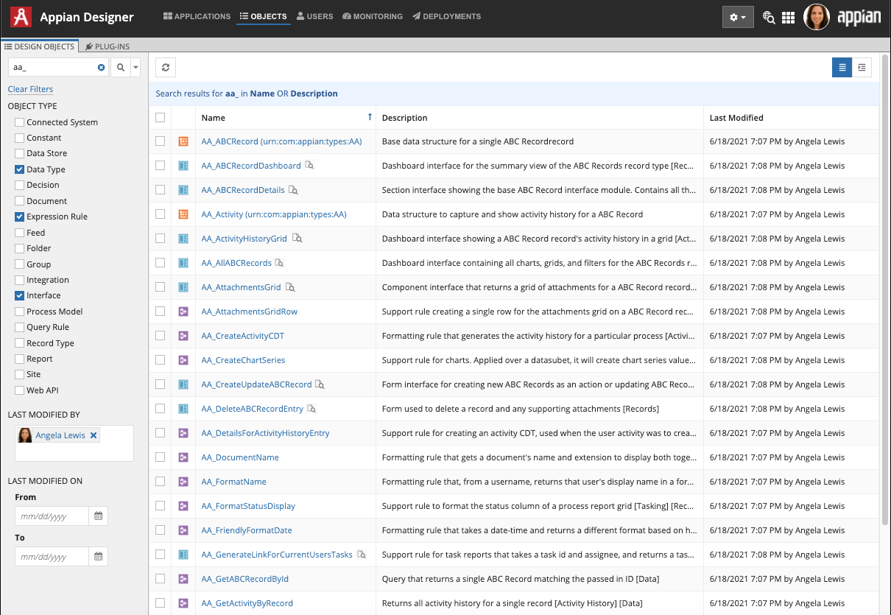

## Objects View

The **Objects View** consists of tabs that list design objects and plug-ins across all applications in the environment. This view is useful for finding a specific object quickly to edit it or add it to your application.

### Design Objects Tab

The **Design Objects** tab displays objects when you apply filters or search by name or description. See [Designer Search](https://docs.appian.com/suite/help/22.1/find_and_search_in_appian.html) for more information about how to efficiently search for objects.

The objects list (below and to the right of the Design Objects tab) consists of four columns and is sorted by most recently modified:
* **Object Type Icon**: A quick visual indicator of each object's type.
* **Name**: The name of the object as a hyperlink to open the object. A preview icon displays next to the name of any interface object. Hover over this icon to view a preview of the interface.
* **Description**: The description of the object. The display truncates descriptions longer than 96 characters. Hover over the description to see the entire description as a tooltip.
* **Last Modified**: The default sort field of the grid. Shows developers who last modified the object and when.

#### Object Options

When you select an object in the list, options will appear in the toolbar. You can select multiple objects for specific bulk actions.

The following options are available in the Design Objects tab:
* **Add to App**: Allows one or more objects to be added to any application that the developer has permission to.
* **Security**: Allows developers to adjust the [security](https://docs.appian.com/suite/help/22.1/object-security.html) of an object. Developers must have at least **Administrator** permissions on the selected object.
* **Dependents**: Allows developers to view what object or objects depend on the selected object.
* **Precedents**: Allows developers to see what object or objects the selected object depends on.
* **Delete**: Allows one or more objects to be deleted.
  * If you delete a single object, a warning dialog contains the results of a dependent objects scan. This dialog allows you to review all objects that would be impacted by the deletion.
  * Only system administrators can delete data types, group types, or multiple objects.
  * Only a system administrator can delete a folder, even if the folder has contents. Deleting the folder deletes all of its contents.
  * If you select multiple objects, a warning dialog lists all objects included in the deletion.
  * You can track deleted objects and plug-ins in the [deletions log](https://docs.appian.com/suite/help/22.1/Logging.html#deletions).
* **More**: Provides additional actions for an object.
  * **Properties**: Allows developers to view property details for a document, folder, or group that developers can edit.
  * **Versions**: Allows developers to view [previous versions](https://docs.appian.com/suite/help/22.1/Managing_Object_Versions.html) of an object. Developers can compare previous versions with the latest version.
  * **New Version**: Allows developers to upload a new version of a selected document. The new version of the object will retain the same local ID, but will point to a different file.
  * **Rename**: Allows developers to rename an object. This option will also update any expression that's calling an object with the new object name. Constants, decisions, expression rules, integrations, and interfaces can all be renamed from the toolbar.
  * **Download**: Allows developers to download one or multiple documents.
  * **View Documentation**: Provides a [process model documentation report](https://docs.appian.com/suite/help/22.1/process-model-object.html#generating-process-model-documentation).

#### Hierarchical View

You can view objects in the Design Objects tab by clicking the flat view or hierarchical view button at the list. By default, the view is flat and displays all objects. Switching to hierarchical view will display only the top-level objects and hide the rest, so that you can more easily navigate folder hierarchies.